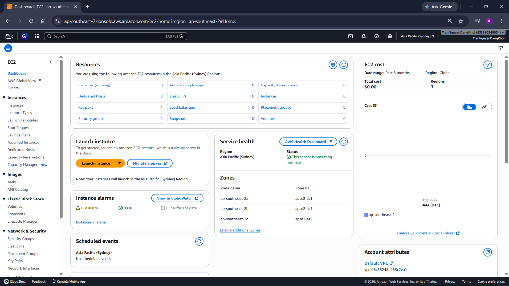

### Mục tiêu tuần 1:

* Làm quen với chương trình First Cloud Journey và môi trường học tập.
* Nắm được các khái niệm cơ bản về điện toán đám mây và hệ sinh thái AWS.
* Chuẩn bị tài khoản và công cụ cần thiết để thực hiện các bài thực hành.

### Các công việc cần triển khai trong tuần này:

| Thứ | Công việc | Ngày bắt đầu | Ngày hoàn thành | Nguồn tài liệu |
| --- | --- | --- | --- | --- |
| 2 | - Tham gia buổi giới thiệu chương trình First Cloud Journey. - Tìm hiểu lộ trình học và các quy định trong quá trình thực tập. | 19/04/2026 | 19/04/2026 | First Cloud Journey |
| 3 | - Nghiên cứu khái niệm Cloud Computing. - Phân biệt IaaS, PaaS và SaaS. - Tìm hiểu các nhóm dịch vụ chính của AWS. | 20/04/2026 | 20/04/2026 | https://cloudjourney.awsstudygroup.com/ |
| 4 | - Đăng ký tài khoản AWS Free Tier. - Khám phá giao diện AWS Management Console. - Cài đặt AWS CLI trên máy tính. | 21/04/2026 | 21/04/2026 | https://cloudjourney.awsstudygroup.com/ |
| 5 | - Cấu hình AWS CLI bằng Access Key và Secret Access Key. - Thực hành một số lệnh CLI cơ bản để kiểm tra kết nối với AWS. | 22/04/2026 | 22/04/2026 | https://cloudjourney.awsstudygroup.com/ |
| 6 | - Tìm hiểu Amazon EC2, AMI và Security Group. - Thực hành khởi tạo và quản lý EC2 Instance cơ bản. | 23/04/2026 | 24/04/2026 | https://cloudjourney.awsstudygroup.com/ |

### Kết quả đạt được tuần 1:

* Hiểu được khái niệm Cloud Computing và lợi ích khi triển khai ứng dụng trên nền tảng điện toán đám mây.

* Nắm được cấu trúc cơ bản của hệ sinh thái AWS và chức năng của một số dịch vụ phổ biến như:
  * Amazon EC2
  * Amazon S3
  * Amazon VPC
  * Amazon RDS
  * AWS IAM

* Hoàn thành việc đăng ký tài khoản AWS Free Tier và truy cập thành công AWS Management Console.

 

* Cài đặt và cấu hình AWS CLI thành công trên máy tính.

* Kiểm tra kết nối với AWS bằng các lệnh CLI cơ bản như:
  * `aws configure`
  * `aws sts get-caller-identity`
  * `aws ec2 describe-regions`

* Làm quen với quy trình tạo và quản lý EC2 Instance, bao gồm:
  * Khởi tạo EC2 Instance
  * Thiết lập Security Group
  * Tạo Key Pair
  * Kết nối đến máy chủ
  * Dừng và xóa Instance sau khi hoàn thành thực hành

 

* Hiểu được cách quản lý tài nguyên thông qua AWS Management Console và AWS CLI.

 

* Có thể sử dụng kết hợp giao diện web và dòng lệnh để thực hiện các thao tác quản lý tài nguyên AWS cơ bản, tạo nền tảng cho các nội dung thực hành ở những tuần tiếp theo.

